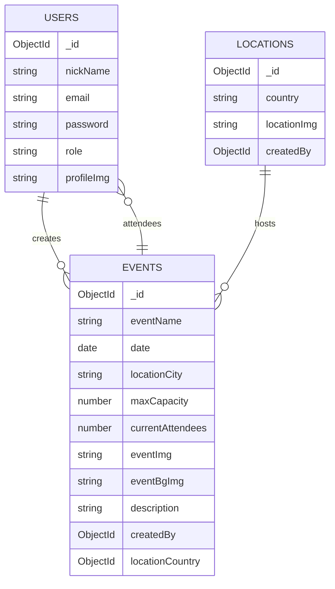

# EventHub API - Backend (WORK IN PROGRESS)

API REST construida con **Node.js**, **Express**, **MongoDB (Mongoose)** y **Cloudinary** para gestionar **usuarios, eventos y localizaciones**.

Permite creación, lectura, actualización y eliminación de datos, manejo de imágenes mediante Cloudinary, sistema de **autenticación con JWT** y autorización por **roles** (`user`, `admin`).

---

## 🚀 Instalación y uso

### 1. Clona el repositorio:

```bash
git clone https://github.com/AleixSu/Project13.Final_Project_BackEnd-.git
```

### 2. Entra al directorio del backend:

```bash
cd backend
```

### 3. Instala dependencias:

```bash
npm install
```

### 4. Crea archivo `.env` en la raíz:

```env
DB_URL=mongodb+srv://<USER>:<PASSWORD>@cluster.mongodb.net/eventhubDB
JWT_SECRET=supersecret
CLOUD_NAME=<cloudinary_name>
API_KEY=<cloudinary_key>
API_SECRET=<cloudinary_secret>
PORT=3000
```

### 5. Inicia servidor en desarrollo:

```bash
npm run dev
```

### 6. Para producción:

```bash
npm start
```

**Base URL (desarrollo):**  
`http://localhost:3000/api/v1`

**Base URL (producción):**  
`https://tu-backend.onrender.com/api/v1`

---

## Endpoints disponibles

### Users

**Base:** `/api/v1/users`

| Método | Endpoint    | Descripción                                                | Acceso            |
| ------ | ----------- | ---------------------------------------------------------- | ----------------- |
| POST   | `/login`    | Inicia sesión y devuelve token JWT                         | Libre             |
| POST   | `/register` | Registra usuario con imagen opcional                       | Libre             |
| GET    | `/profile`  | Devuelve datos del usuario autenticado (populate avanzado) | Autenticado       |
| GET    | `/`         | Obtiene todos los usuarios                                 | Libre             |
| GET    | `/:id`      | Obtiene usuario por ID                                     | Libre             |
| PATCH  | `/:id`      | Actualiza usuario (propietario o admin)                    | Propietario/Admin |
| DELETE | `/:id`      | Elimina usuario (propietario o admin)                      | Propietario/Admin |

**Ejemplo de body para registro:**

```json
{
  "nickName": "aleix",
  "email": "test@test.com",
  "password": "Aa123456!",
  "location": "Barcelona"
}
```

---

### Events

**Base:** `/api/v1/events`

| Método | Endpoint         | Descripción                                      | Acceso      |
| ------ | ---------------- | ------------------------------------------------ | ----------- |
| GET    | `/`              | Obtiene todos los eventos (populate completo)    | Libre       |
| GET    | `/location/:ids` | Obtiene eventos filtrados por países             | Libre       |
| GET    | `/:id`           | Obtiene evento por ID                            | Libre       |
| POST   | `/`              | Crea evento con imágenes (eventImg, eventBgImg)  | Admin       |
| PATCH  | `/:id`           | Actualiza evento con imágenes opcionales         | Admin       |
| PATCH  | `/:id/sign_up`   | Inscripción del usuario autenticado en el evento | Autenticado |
| PATCH  | `/:id/unsign_up` | Cancelación de asistencia del usuario            | Autenticado |
| DELETE | `/:id`           | Elimina evento                                   | Admin       |

**Ejemplo de body para POST:**

```json
{
  "eventName": "Tech Meetup",
  "date": "2025-01-20",
  "locationCountry": "ObjectId('...')",
  "locationCity": "Berlin",
  "maxCapacity": 50,
  "description": "Networking y charlas"
}
```

---

### Locations

**Base:** `/api/v1/locations`

| Método | Endpoint     | Descripción                       | Acceso |
| ------ | ------------ | --------------------------------- | ------ |
| GET    | `/`          | Devuelve todas las localizaciones | Libre  |
| GET    | `/countries` | Lista países con su ID            | Libre  |
| GET    | `/:id`       | Obtiene una localización por ID   | Libre  |
| POST   | `/`          | Crea localización con imagen      | Admin  |
| PATCH  | `/:id`       | Actualiza localización            | Admin  |
| DELETE | `/:id`       | Elimina localización              | Admin  |

**Ejemplo body para POST:**

```json
{
  "country": "Spain"
}
```

---

## Roles y autenticación

- **user** → Operaciones sobre su propio perfil, asistir o cancelar asistencia a eventos
- **admin** → CRUD completo de eventos y localizaciones, puede editar y eliminar usuarios

Los tokens JWT se envían mediante header:

```
Authorization: Bearer <token>
```

---

## Tecnologías usadas

- **Node.js** + **Express**
- **MongoDB** + **Mongoose**
- **Cloudinary** + **multer-storage-cloudinary**
- **bcrypt** (encriptación de contraseñas)
- **jsonwebtoken** (autenticación JWT)
- **dotenv** (variables de entorno)
- **nodemon** (desarrollo)

---

## Relaciones entre colecciones



---

## Manejo de imágenes

Imágenes cargadas a **Cloudinary** mediante `multer-storage-cloudinary`.

Borrado mediante utilidad personalizada que obtiene `public_id` desde la URL y ejecuta:

```js
cloudinary.uploader.destroy(public_id)
```

**Formatos permitidos:** `jpg`, `png`, `jpeg`, `gif`, `webp`

---

## Manejo de errores

Middleware centralizado que identifica errores de validación de Mongoose y retorna mensajes claros.

Para otros casos, responde código y mensaje genérico.

**Rutas no especificadas:**

```js
app.use((req, res) => {
  res.status(404).json({ error: 'Route not found' })
})
```

---

## Recomendaciones para testeo

1. Registra un usuario normal y un admin mediante seed o DB
2. Usa el token del admin para crear localizaciones y eventos
3. Usa cuenta de usuario para inscribirte o cancelar asistencia
4. Verifica eliminación de imágenes en Cloudinary al borrar entidades

---

## Despliegue

### Recomendado: Render.com

1. Crea cuenta en [render.com](https://render.com)
2. Conecta tu repositorio de GitHub
3. Crea un nuevo "Web Service"
4. Configura las variables de entorno:
   - `DB_URL`
   - `JWT_SECRET`
   - `CLOUD_NAME`
   - `API_KEY`
   - `API_SECRET`
5. Deploy automático

---

## Scripts disponibles

```bash
npm run dev    # Inicia servidor en modo desarrollo con nodemon
npm start      # Inicia servidor en modo producción
```

---

## Autor

**Aleix Suero Corral**  
GitHub: [@AleixSu](https://github.com/AleixSu/)

---

---
